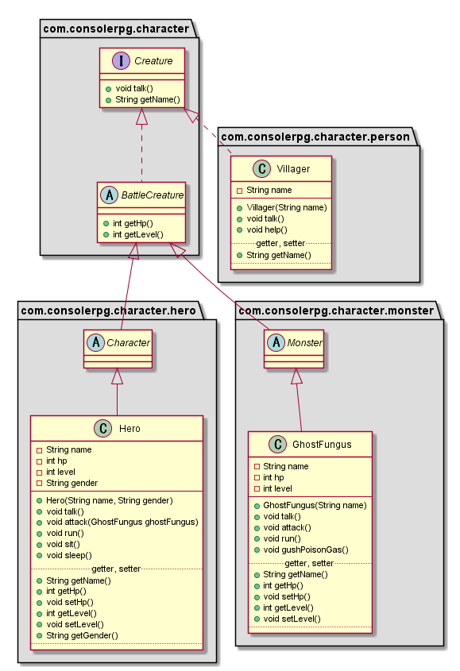

# Q04. キャラクターの抽象クラスを作ろう
## 【課題】
1. 生き物を表すインタフェース(Creature)を作成する
2. 戦闘する生き物を表す抽象クラス(BattleCreature)を作成する
3. モンスターを表す抽象クラス(Monster)、キャラクターを表す抽象クラス(Character)を作成する
4. クラス図の通りになるよう今まで作成してきたクラスを修正する

## Q3とQ4のクラス図
Q3時点のクラス図  

Q4のクラス図  
